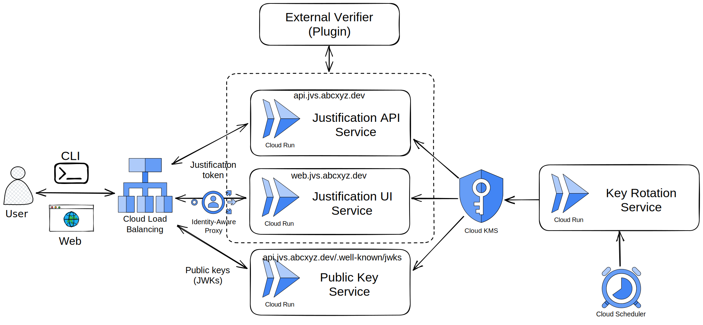

# Justification Verification Service (JVS)

**JVS is not an official Google product.**

This repository contains components related to a justification verification
service

## Use Case

Audit logs are special logs that record **when** and **who** called **which**
application and accessed **what** data. And **why** the access was necessary
(aka. the justification of the data access). JVS is a solution to produce
verified justifications, and in combination with
[abcxyz/lumberjack](https://github.com/abcxyz/lumberjack), the justifications
could be audit logged.

## Architecture



JVS consists of the following components:

*   **Justification API service**: Verify justifications and mint short-lived
    justification tokens. Find more about the API [here](./docs/apis.md).

*   **jvsctl CLI**: This is the primary interface into the JVS and server
    components. Find more about the CLI [here](./docs/cli.md).

*   **Web UI**: Support requesting justification tokens from web pages. Find
    more about the web UI and flow [here](./docs/web-ui.md).

*   **Public Key service**:
    [JWKs](https://auth0.com/docs/secure/tokens/json-web-tokens/json-web-key-sets)
    endpoint for retrieving public keys to validate justification tokens.

*   **Cert Rotator service**: Rotate signing keys stored in
    [Cloud KMS](https://cloud.google.com/security-key-management). Triggered by
    [Cloud Scheduler](https://cloud.google.com/scheduler).

## End User Workflows

**CLI flow**: Calling REST or gRPC APIs from command line with justification.

1.  The requester uses [`jvsctl`](./docs/cli.md) to request a justification
    token by giving a reason.
2.  The justification API will authenticate the requester, verify the provided
    reason and return a justification token after verification.
3.  The requester then can use the justification token in REST or gRPC requests
    header (HTTP header or gRPC metadata).
4.  The REST or gRPC service server is responsible to validate the justification
    token in the requests header and audit log it down.
    [abcxyz/lumberjack](https://github.com/abcxyz/lumberjack) client SDK
    provides this functionality.

**Web flow**: Accessing web pages with justification.

1.  The web page(s) must redirect the requester to the JVS web UI when the
    access happens. See [example](./docs/web-ui.md).
2.  The JVS web UI will authenticate the requester and ask the requester to
    provide a reason.
3.  The JVS web UI will verify the provided reason and after verification
    redirect back to the original web page(s) along with the justification
    token.
4.  The original web app will then be able to cache and use the justification
    token to call its backend.
5.  The web app's backend is responsible to validate the justification token in
    the requests header and audit log it down.
    [abcxyz/lumberjack](https://github.com/abcxyz/lumberjack) client SDK
    provides this functionality.

## Installation

You can use the provided Terraform module to setup the basic infrastructure
needed for this service. Otherwise you can refer to the provided module to see
how to build your own Terraform from scratch.

```terraform
module "jvs" {
  source     = "git::https://github.com/abcxyz/jvs.git//terraform/e2e?ref=main" # this should be pinned to the SHA desired
  project_id = "YOUR_PROJECT_ID"

  # Specify who can access JVS.
  jvs_invoker_members = ["user:foo@example.com"]

  # Use your own domain.
  jvs_api_domain = "api.jvs.example.com"
  jvs_ui_domain  = "web.jvs.example.com"

  iap_support_email = "support@example.com"

  jvs_container_image = "us-docker.pkg.dev/abcxyz-artifacts/docker-images/jvsctl:0.0.5-amd64"
}
```

## External Verifier

JVS itself only supports two types of reasons:

*   Manual explanantion
*   Breakglass

We plan to introduce a plug-in model for external verifiers as JVS extensions.
E.g. The ability to verify if a Github issue exists.
